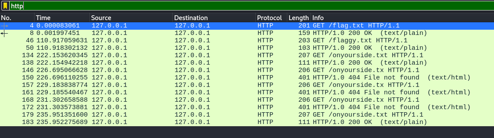
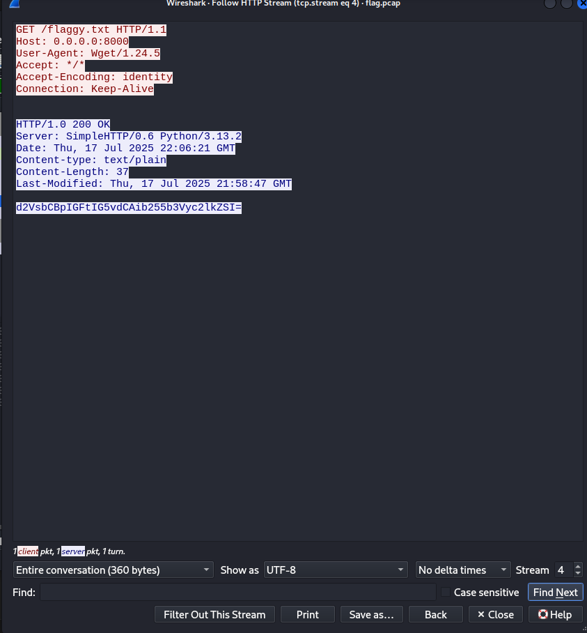
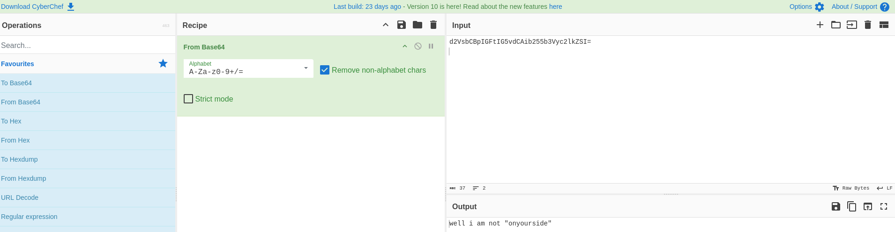
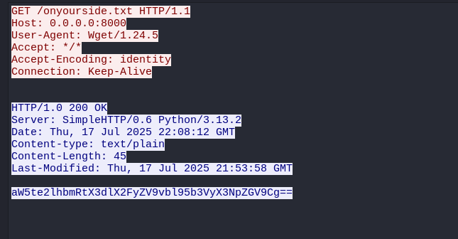
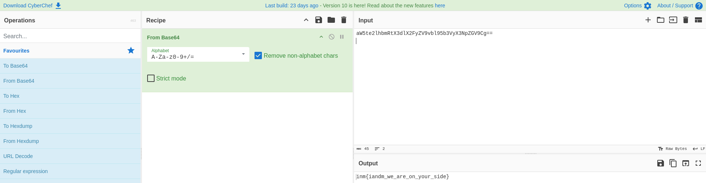

# Catch if you Can🕵️‍♂️🧩🔍💻🎭

## Solution

The challenge description and emojis hinted at something hidden within layers of network traffic (🧩🧅). My first step was to open the provided capture.pcap file (or whatever the file was named) in Wireshark.

The packet capture contained a massive amount of traffic. To make sense of it, I needed to apply filters. Given the sheer number of HTTP requests (a common protocol for hiding data).

I started with the most basic filter: *http*.

## Initial Reconnaissance with HTTP Filter

Applying the http filter immediately narrowed down the packets to just web traffic.

Scrolling through the list, I noticed a pattern: many GET requests were being made for various .txt files.

This seemed highly suspicious and was likely where the flag was hidden.

Some of the files I saw included:

    flag.txt

    flaggy.txt

    onyourside.txt

    

## Following the (First) Rabbit Hole

My eyes were drawn to flaggy.txt. It's human nature to go for the most obvious target! To analyze this request, I right-clicked on the GET /flaggy.txt packet and navigated to:
    *Follow -> HTTP Stream.*

This fantastic Wireshark feature reconstructs the entire HTTP conversation for that request and response, allowing me to see the full content of the file that was transferred.

The HTTP stream for flaggy.txt revealed its content: a string of characters encoded in Base64.

I copied this text and decoded it using an online tool : CyberChef

The decoded message read:
"well am not "onyouside""

This was a classic CTF rabbit hole! It wasn't the flag, but it was actually a brilliant hint.

It was taunting me, saying the real secret wasn't in flaggy.txt but was instead in a file called onyouside.txt.

## Finding the Real Flag

With the hint, I went back to my filtered HTTP view in Wireshark and found the packet for the GET request to onyourside.txt.

I right-clicked on this packet and again selected Follow -> HTTP Stream.

In the HTTP stream window, I saw the content of the onyourside.txt file. Just like the previous file, it contained a block of Base64 encoded data.

I carefully copied this encoded string and proceeded to decode it, just as I had done before.

The decoding revealed the final, complete flag:

    inm{iandm_we_are_on_your_side}

