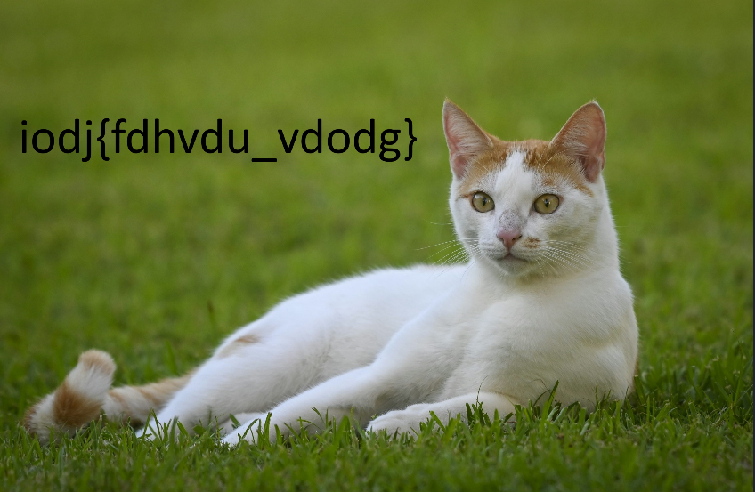

# Greek in Cyber Security

## 1. Extract the Hidden Text from the Image

The first clue is that text is embedded in the image once you open it.This string, wrapped in curly braces, immediately looked like the target.

    `iodj{fdhvdu_vdodg}`



## 2. Analyze the Extracted Text

The extracted string was iodj{fdhvdu_vdodg}. My analysis was:

- It follows the common CTF flag format flag{...}
- iodj is likely the ciphertext for flag. Similarly, the words inside appear to be a single phrase separated by an underscore.
- The challenge name, "Greek in Cyber Security," is a misdirection!
- It actually points to Julius Caesar, a famous Roman (not Greek) general who used a cipher.This is a classic Caesar Cipher.

Why I decided on Caesar Cipher:

- The word "Caesar" is one of the most famous names associated with ancient Rome.
- In cybersecurity, the Caesar Cipher is the most basic and well-known substitution cipher, often used in beginner CTFs.
- The structure iodj -> flag is a very common shift. For example, f (6th letter) to i (9th letter) is a shift of +3.

## 3. Decipher the Text

I needed to shift each letter backward by 3 positions in the alphabet to decrypt it. I used CyberChef for its speed and convenience.

## Alternative Method: Manual Decryption

1. For completeness, here is how you could solve it manually:

    - Write down the alphabet: a b c d e f g h i j k l m n o p q r s t u v w x y z

    - For each letter in the ciphertext, find it and go back 3 letters.
  
        ```
        i -> f

        o -> l

        d -> a

        j -> g

        f -> c

        d -> a

        h -> e

        v -> s

        d -> a

        u -> r

        v -> s

        d -> a

        o -> l

        d -> a

        g -> d

        ```

- This gives you *flag{caesar_salad}*

- The decrypted text, **flag{caesar_salad}**, makes perfect sense:
    - It starts with the correct flag format flag{...}.
    - It is a clever and humorous pun combining the name of the cipher (Caesar) with a well-known dish (salad), a common trope in CTF challenges.
