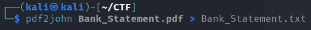
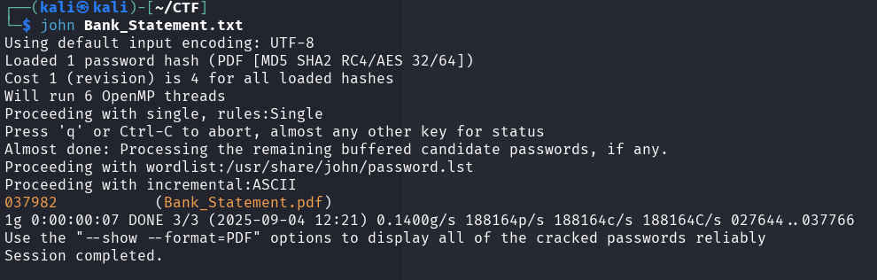
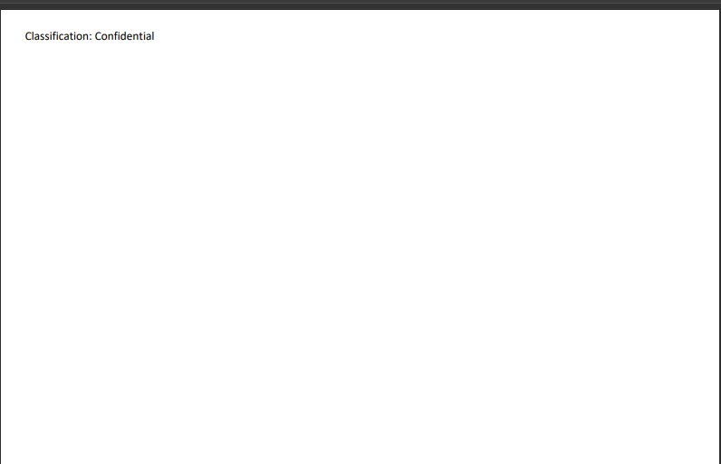
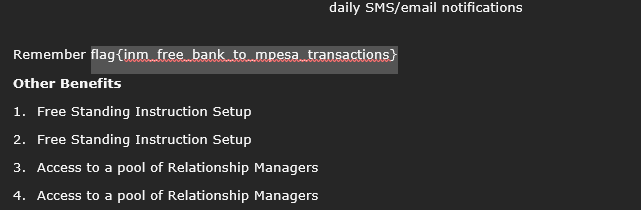

# Silent Guardian

In this challenge we are given a simple Bank Statement pdf file to analyse. But is it really that simple? We know that banks never just hand you bank statement without password protecting them. 

So on attempting to open the statement, we are asked to enter the password. So the obvious next course is to try and guess the password. But how long will it take to manually guess the password whose length we don't even know? Well, let's head to Google and our favorite AI tools to see what options do we have that we can use to crack the password.

We come across a suggestion to use pdf2john. Nice one. Let's contract John to do the dirty work for us so that incase they get caught, we are safe😅

1. Let's extract the cryptographic hash from the PDF file. This hash is what john will actually try to crack. The `Bank_Statement.txt` from the following command has the hash.

    ```bash
    pdf2john Bank_Statement.pdf > Bank_Statement.txt
    ```
    

2. Contracting John to do what it does best, that is bruteforcing the password hash against the wordlist.

   ```bash
   john Bank_Statement.txt
   ```
   

3. Use the cracked password to open the Bank_Statement.pdf file.

4. That simple!

   But why is it an empty file? ....mmmh I see you mentioned **confidential** but I just breached your weak password. Trying to highlight inside the document I can see some lines.

   So you made it transparent? Nice move.
   
   

6. Highlighting and copy pasting this to a text editor reveals juicy information about the PayGo Account. But that's not what you told me I'd be seeing. Anyway. Mission completed. Here's the flag.

   ```bash
   flag{inm_free_bank_to_mpesa_transactions}
   ```
   
    

