# Compromised server writeup

    Note: This writeup contains additional questions which were not included in the challenge for context

## Q1. What is the IP address of the attacker?

First things first, we have to get the attacker's IP order to know how
the flow of the traffic. Under statistics click on
conversations[]

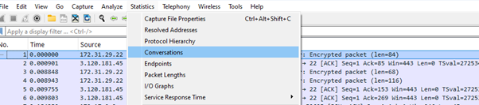

Then under IPv4, sort in descending order. Based on the number of
packets being sent from address A-\>B and B-\>A we can observe the
highest traffic between 95\[.\]164\[.\]9\[.\]144 and 172.17.0.2 which
suggests communication between the attacker and the server.

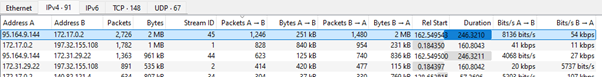

To verify this further, we can look up the IP address on virustotal

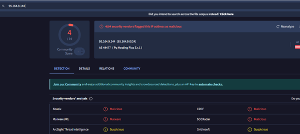

The IP is flagged as malicious, hence confirming our suspicions.

## Q2. To determine if there are any exploits targeting the server identify the build version of the web server service. What is the build version?

In the pcap we need to filter for POST requests so as to see the server
responses. One can filter using http.request.method==POST &&
ip.src==95.164.9.144 or just for the POST excluding the src ip.

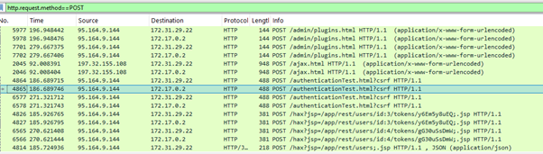

Then right click on the packet to follow stream.

Analysis of the PCAP showed numerous POST requests from the attacker to
the vulnerable server. While most requests returned normal responses,
the */authenticationtest* request exposed the server's build
information. This likely occurred because the endpoint was verbose or
misconfigured, allowing the attacker to fingerprint the system and
prepare for further exploitation.

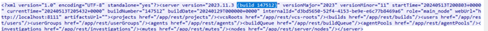

## Q3. The attacker took advantage of a known exploit to that version of the service. What is the CVE number for the exploit that he used?

To get this, we must keep in mind the service name and version from the
responses as shown below.

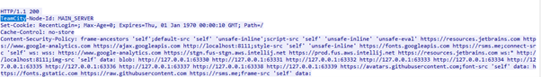

We search for the service name i.e. Teamcity version 2023.11.3 and the
build version on Google and the results show that the vulnerability
exploited is **CVE-2024-27198** is an authentication bypass
vulnerability in the web component of TeamCity that arises from an
alternative path issue
([CWE-288](https://cwe.mitre.org/data/definitions/288.html)) and has a
CVSS base score of 9.8 (Critical).

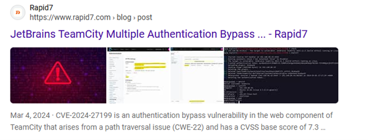

Reading more on this reveals the CVE as **CVE-2024-27198**

More information is available [*Message from Rapid7
Chat*](https://www.rapid7.com/blog/post/2024/03/04/etr-cve-2024-27198-and-cve-2024-27199-jetbrains-teamcity-multiple-authentication-bypass-vulnerabilities-fixed/)

## Q4. The attacker created multiple usernames and passwords on the service. What is the first username and password created?**

To get this we need to look out for suspicious POST requests in the
logs.

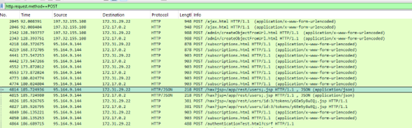

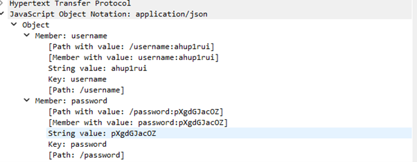

Or, right click to follow stream. We can see the attacker created a user
by the name "ahup1rui" with a password of "pXgdGJacOZ"

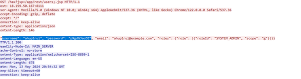

## Q5. The attacker used the newly created user to upload a web shell. What endpoint was used to upload the web shell?**

Still on the POST requests, we need to find the endpoint used for
uploading plugins to the service.

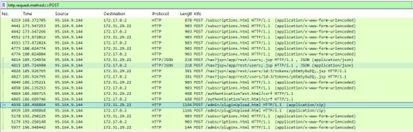

## Q6. The attacker uploaded a web shell using the newly created user.What is the full URL of the uploaded web shell?**

To get this, we'll need to explore the network stream related to the
previous question. Upon following the stream, we came across this file
5z6p8kCA.zip which contained the 5z6p8kCA.jar file as shown below.

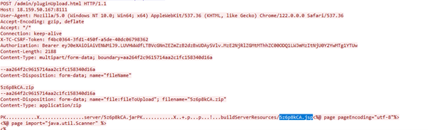

To get the full URL, we need to look for the packet that contained the
highlighted file above and view the corresponding http metadata.

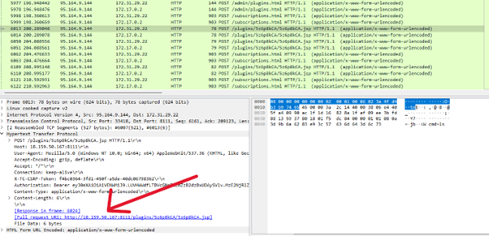

## Q7. **The attacker created another user named 41m67llo and uploaded another web shell. What is the name of the ZIP file that was uploaded?**

Since we are already given the username, we can just go ahead and filter
for POST requests related to the plugin uploads.

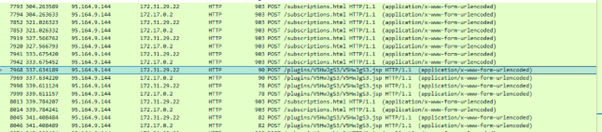

Upon following the TCP stream, we confirmed that it's indeed the second
user created.

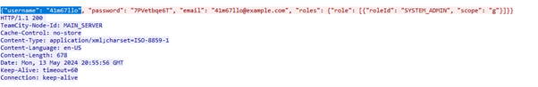

Scroll down to find the zip file uploaded as shown

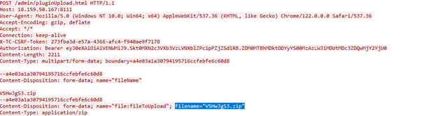

## Q8. The attacker created a file on the system containing some text.What is the text inside that file?

To get the contents of the file we need to explore the remaining network
stream data.

On the same packet from the previous question, view the HTML form URL
Encoded section and expand that.

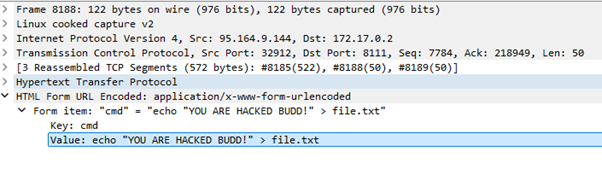
