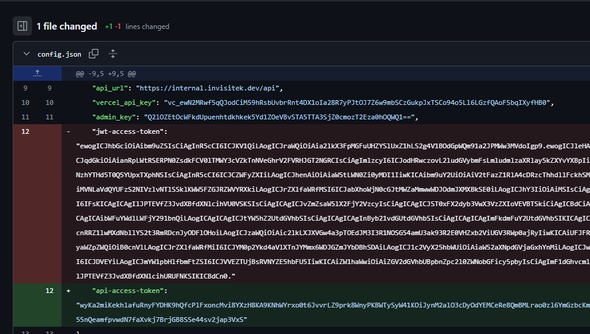

# CTF Challenge: "Makaveli the committer"
## Challenge Hint
> *"They say the internet never forgets...  
> And honestly, the Wayback Machine kinda proves that.  
> But does GitHub work the same way? 🤔 Maybe. Maybe not. Only one way to find out."*

This clearly pointed toward **GitHub commit history** — even if files are deleted, older commits may still hold secrets.

---

## Steps to Solve

### 1. Identify the Repository
From the hint and challenge description, the target repository was:InvisiTech-Labs/cli-planner

### 2. Browse Commit History
- Navigate to the repo on GitHub.  
- Open the **Commits** tab.  
- Scroll through older commits, focusing on ones that referenced **tokens**, **secrets**, or **JWTs**.  

Eventually, an older commit revealed a file containing a **JWT access token**.  
The file had since been deleted in later commits, but GitHub preserved it in history.

### 3. Extract the JWT
The recovered token looked like this (truncated):

  - "exp": 1760520000,
  - "iat": 1752832295,
  - "azp": "inm-ctf-2025",
  - "email": "devteam@invisitechlabs.io",
  - "key_id_1": "ZmxhZ3tpbm1fZ2l0X2NvbW1pdHM",
  - "key_id_2": "X3JvbGxiYWNrX2lzX2FfbXl0aH0",
  - "preferred_username": "aW52aXNpdGVjaGxhYnM=",
  - "family_name": "Q1RGMjAyNQ=="

### 4. Decode Embedded Base64 Values

- Some fields in the payload were base64 strings themselves:

- key_id_1 → flag{inm_git_commits

- key_id_2 → _rollback_is_a_myth}

### 5. Concatenating them gave the final flag

-flag{inm_git_commits_rollback_is_a_myth}
