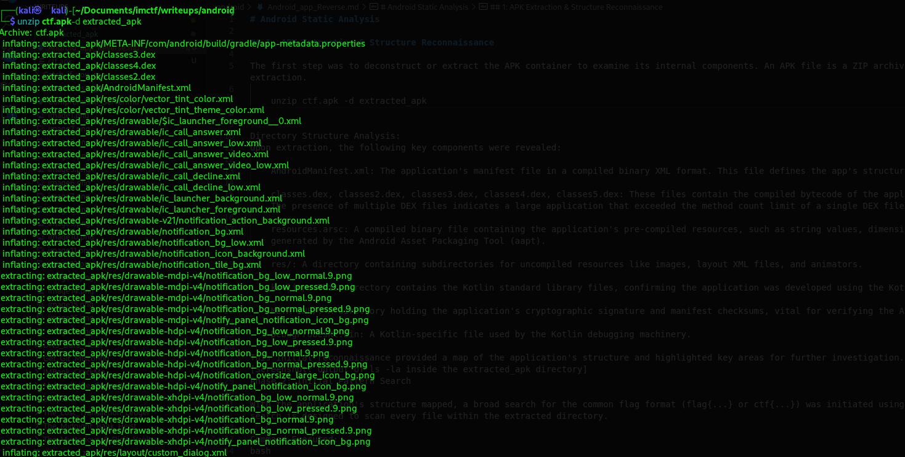
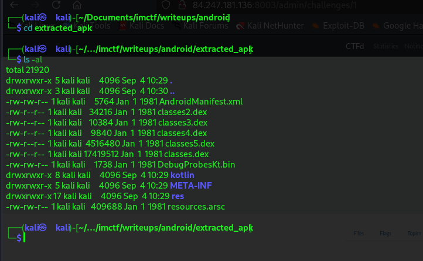
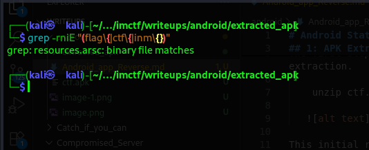
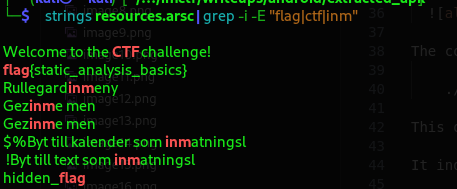

# Android Static Analysis

## 1: APK Extraction & Structure Reconnaissance

The first step was to deconstruct or extract the APK container to examine its internal components. An APK file is a ZIP archive in structure, allowing for easy extraction.

    unzip ctf.apk -d extracted_apk

   

This initial reconnaissance provided a map of the application's structure and highlighted key areas for further investigation.

### Directory Structure Analysis:Upon extraction, the following key components were revealed

    AndroidManifest.xml: The application's manifest file in a compiled binary XML format. This file defines the app's structure, permissions, and components.

    classes.dex, classes2.dex, classes3.dex, classes4.dex, classes5.dex: These files contain the compiled bytecode of the application written in Java and Kotlin. The presence of multiple DEX files indicates a large application that exceeded the method count limit of a single DEX file.

    resources.arsc: A compiled binary file containing the application's pre-compiled resources, such as string values, dimensions, and styles. This file is generated by the Android Asset Packaging Tool (aapt).

    res/: A directory containing subdirectories for uncompiled resources like images, layout XML files, and animators.

    kotlin/: This directory contains the Kotlin standard library files, confirming the application was developed using the Kotlin programming language.

    META-INF/: A directory holding the application's cryptographic signature and manifest checksums, vital for verifying the APK's integrity.

    DebugProbesKt.bin: A Kotlin-specific file used by the Kotlin debugging machinery.

## 2: Initial Pattern Search

With the application's structure mapped, a broad search for the common flag format (flag{...} or ctf{...}) or inm{} was initiated using a recursive grep command. This search is designed to scan every file within the extracted directory.

    grep -rniE "(flag\{|ctf\{|inm\{}).

  

The command returned a single result:

    ./resources.arsc: binary file matches

This output was highly significant.

It indicated that the searched pattern was present within the resources.arsc binary file but could not be displayed as text by grep.

This pinpointed the resources.arsc file as the primary location of interest for the hidden flag.

## 3: Deep Dive into Binary Resources

The resources.arsc file is a compiled binary, requiring specialized tools to extract human-readable data.

The strings utility was employed, which scans a binary file and extracts all contiguous sequences of printable characters.

This output was then piped into grep to filter for the specific pattern.

    strings resources.arsc | grep -i -E "flag"

   

The command successfully extracted two relevant strings from the binary:

    hidden_flag

    flag{static_analysis_basics}

The first string, hidden_flag, was determined to be a decoy—a common tactic in CTF challenges to mislead participants.

The second string, flag{static_analysis_basics}, was the correctly formatted flag and the solution to the challenge.

## The Flag

    flag{static_analysis_basics}

## Conclusion & Key Takeaways

This challenge was successfully solved by applying fundamental static analysis techniques to an Android application. The key to success was the systematic approach:

    Deconstruction: The APK was treated as a container and extracted to access its components.

    Broad Analysis: A recursive search quickly identified which specific file contained the target data, efficiently narrowing the focus from hundreds of files to one.

    Binary Analysis: The use of the strings tool to extract printable data from a compiled binary file demonstrated that compilation is not equivalent to obfuscation. Strings embedded in binaries are often easily recoverable.

The vulnerability exploited in this challenge is a developer misconception: assuming that storing a sensitive string (the flag) within the compiled resources would hide it effectively. In reality, as proven, such data remains easily accessible to anyone with basic forensic tools, highlighting the importance of proper secrets management and code obfuscation in mobile application security.
