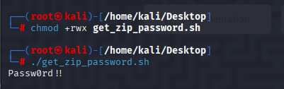

# DevSecOps Git Misconfiguration
## Background
Your company set up a CI/CD pipeline for its DevSecOps workflow.  
Due to a **Git misconfiguration**, a secret was mistakenly uploaded and later stuffed into a pipeline artifact.  
Your mission: **extract the secret and find the hidden flag**.

---

## Files Available

- `devsecops.zip` — the outer archive that contains everything you need
  - Inside it you’ll find:
    - `launch.sh` — a helper script that reveals a password
    - `protected.zip` — an inner, password-protected archive containing a CI config with a misconfiguration

      

> You only need a terminal with `unzip` and permission to execute shell scripts.

  ```sh
  chmod +x launch.sh
  ./launch.sh
  ```

  ```unzip -P <password_from_launch.sh> protected.zip```

> get the flag --------------------------->   inm{You'rectfchampion}


