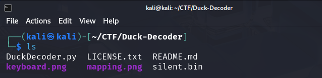
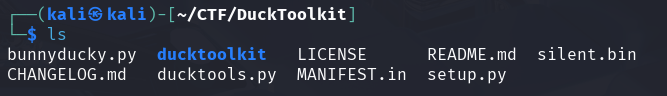

# Analyzing Injector Payload

## Executive Summary

The provided file, silent.bin, is a payload for a USB Rubber Ducky, a keystroke injection tool. The payload is encoded in a binary format that maps to USB HID (Human Interface Device) codes. The goal is to decode this binary file back into the readable Ducky Script commands, which will reveal the malicious  keystrokes.

## Method 1: Using DuckDecoder

### Prerequisites

- Python 2.7
- duckdecoder.py script

  ```bash
  git clone https://raw.githubusercontent.com/mame82/duckyDecoder/master/duckdecoder.py

The duckdecoder.py script was developed early using Python2 hence not compatible with Python3

## Solution

1. Ensure you have the script and the payload in the same directory to make the process straightforward.

   

2. Run the duckdecoder.py script against the silent.bin file using Python 2.

    ```bash
    python2 DuckDecoder.py decode silent.bin
    ```

3. The script will output the decoded Ducky Script commands to the terminal. Analyze the output.

    ```bash
    DELAY 1000

    GUI R
    DELAY 500

    STRING cmd
    ENTER
    DELAY 500

    STRING tree C:\ /F | more
    ENTER
    DELAY 2000

    STRING timeout 5
    ENTER
    DELAY 1000

    STRING dir C:\Windows\System32 | findstr ".dll" | head -n 20
    ENTER
    DELAY 1000

    STRING ping -n 3 127.0.0.1
    ENTER
    DELAY 1000

    STRING net user
    ENTER
    DELAY 1000

    STRING systeminfo | findstr /B /C:"OS Name" /C:"OS Version"
    ENTER
    DELAY 1000

    STRING powershell -command "Write-Host 'This is a fake flag: FAKE_FLAG{Not_The_Real_One}' -ForegroundColor Red"
    ENTER
    DELAY 1000

    STRING powershell -command "Get-Process | Select-Object -First 10"
    ENTER
    DELAY 1000

    STRING echo "The real flag is hidden somewhere in this payload. Look carefully!"
    ENTER
    DELAY 500

    STRING echo This is the secret CTF flag: flag{inm_Secure_Online_Banking}> secret.txt
    ENTER
    DELAY 500

    STRING type secret.txt
    ENTER
    DELAY 500

    STRING del secret.txt
    ENTER
    DELAY 500

    STRING exit
    ENTER

4. Scanning through the decoded output the flag is visible towards the end of the script.

    ```bash
    STRING echo This is the secret CTF flag: flag{inm_Secure_Online_Banking} > secret.txt
    ```

###Python3
For python3 you can make use of the following script i came up with in the folder named DuckDecoder
	```bash
	cd DuckDecoder 
	```
Then run the script against the silent.bin using python3
	```bash
	python3 decoder3.py decode ../silent.bin
	```	
It will output the same results	
	```bash
	GUI R
	DELAY 1500

	STRING cmd
	ENTER
	DELAY 500

	STRING tree C:\ /F | more
	ENTER
	DELAY 2000

	STRING timeout 5
	ENTER
	DELAY 1000

	STRING dir C:\Windows\System32 | findstr ".dll" | head -n 20
	ENTER
	DELAY 1000

	STRING ping -n 3 127.0.0.1
	ENTER
	DELAY 1000

	STRING net user
	ENTER
	DELAY 1000

	STRING systeminfo | findstr /B /C:"OS Name" /C:"OS Version"
	ENTER
	DELAY 1000

	STRING powershell -command "Write-Host 'This is a fake flag: FAKE_FLAG{Not_The_Real_One}' -ForegroundColor Red"
	ENTER
	DELAY 1000

	STRING powershell -command "Get-Process | Select-Object -First 10"
	ENTER
	DELAY 1000

	STRING echo "The real flag is hidden somewhere in this payload. Look carefully!"
	ENTER
	DELAY 500

	STRING echo This is the secret CTF flag: flag{inm_Secure_Online_Banking}> secret.txt
	ENTER
	DELAY 500

	STRING type secret.txt
	ENTER
	DELAY 500

	STRING del secret.txt
	ENTER
	DELAY 500

	STRING exit
	ENTER
	```

## Method 2: Using DuckToolkit

Another great simple method to approach this challenge was to use DuckToolkit to decode the binary file and output it to simple text file.

### Prerequisites

- Python2.7
- Ducktoolkit

    ```bash
    git clone https://github.com/kevthehermit/DuckToolkit.git

1. Ensure you have the script and the payload in the same directory to make the process straightforward.

   

2. Run the ducktools.py script against the silent.bin file and output the results to a .txt file for analysis later.

    ```bash
    ducktools.py -d -l gb silent.bin silent.txt
    ```

3. Use simple cat command or any text editor to view contents of the file output.

    ```bash
    DELAY
    DELAY
    cmdENTER
    DELAY
    tree C:# /F ~ moreENTER
    DELAY
    timeout 5ENTER
    DELAY
    dir C:#Windows#System32 ~ findstr @.dll@ ~ head -n 20ENTER
    DELAY
    ping -n 3 127.0.0.1ENTER
    DELAY
    net userENTER
    DELAY
    systeminfo ~ findstr /B /C:@OS Name@ /C:@OS Version@ENTER
    DELAY
    powershell -command @Write-Host 'This is a fake flag: FAKE_FLAG{Not_The_Real_One}' -ForegroundColor Red@ENTER
    DELAY
    powershell -command @Get-Process ~ Select-Object -First 10@ENTER
    DELAY
    echo @The real flag is hidden somewhere in this payload. Look carefully!@ENTER
    DELAY
    echo This is the secret CTF flag: flag{inm_Secure_Online_Banking}> secret.txtENTER
    DELAY
    type secret.txtENTER
    DELAY
    del secret.txtENTER
    DELAY
    exitENTER

## In Conclusion

 The payload contained a series of commands that downloaded a PowerShell script from a remote server and wrote a flag to a text file. This challenge highlights the importance of physical security and the dangers of plugging in unknown USB devices.
