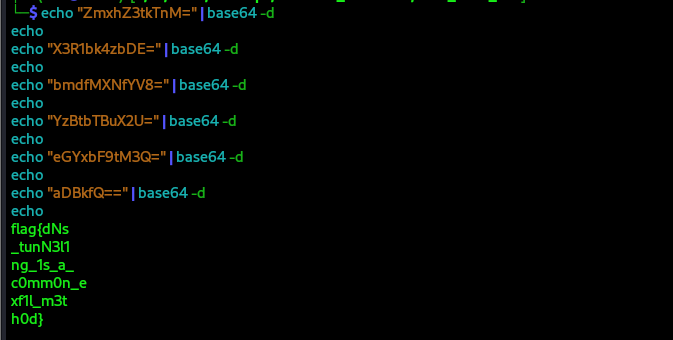

# DNS Data Heist

## Description

The I&M Bank Cybersecurity team detected suspicious DNS traffic from an internal workstation. Forensic analysis revealed that an attacker was exfiltrating sensitive data by hiding it in DNS queries to a rogue server. 

The challenge provided a PCAP file (dns_exfil_challenge.pcap) containing network traffic that needed to be analyzed to extract the exfiltrated flag.

## Solution

### Tools Used

1. **tshark:** Command-line network protocol analyzer (part of Wireshark)
2. **grep:** For filtering specific patterns
3. **sed:** For text processing and extraction
4. **base64:** For decoding the extracted data

### Steps

For this type of CTF challenge, I prefer tshark over the Wireshark GUI for several reasons:

> 1. Efficiency: tshark allows me to quickly filter and extract specific fields without loading the entire GUI interface
> 
> 2. Automation: I can chain multiple commands together in a pipeline for streamlined analysis
> 
> 3. Precision: The command-line approach lets me extract exactly what I need without visual clutter
> 
> 4. Repeatability: My commands create a reproducible analysis process that can be documented step-by-step
> 
> 5. Resource-friendly: tshark consumes significantly fewer system resources than the full Wireshark GUI

#### Step 1: Initial DNS Query Analysis

I started by examining all DNS queries in the packet capture:

```bash
tshark -r dns_exfil_challenge.pcap -Y "dns and dns.flags.response == 0" -T fields -e dns.qry.name
```


**Observation:** I immediately noticed the suspicious domain pattern exfil.badactor.com with sequential numbering (00-05) and encoded payloads, confirming the hint about sequential subdomains.

#### Step 2: Filtering and Sorting the Malicious Queries

I filtered for only the malicious DNS queries and sorted them numerically:

```bash
tshark -r dns_exfil_challenge.pcap -Y "dns and dns.flags.response == 0" -T fields -e dns.qry.name | grep "exfil.badactor.com" | sort
```


> The sequential numbering (part1-XXX, part2-YYY from the hint) was clearly visible, confirming this was the exfiltration channel.

#### Step 3: Extracting the Base64 Payloads

I stripped away the domain structure to isolate only the encoded data:

```bash
tshark -r dns_exfil_challenge.pcap -Y "dns and dns.flags.response == 0" -T fields -e dns.qry.name | grep "exfil.badactor.com" | sort | sed 's/^[0-9]*-//'sed's/\.exfil\.badactor\.com$//'
```


> These appeared to be Base64-encoded strings, which is a common encoding method for data exfiltration.

#### Step 4: Decoding the Exfiltrated Data

I concatenated all the Base64 strings and decoded them:

```bash
tshark -r dns_exfil_challenge.pcap -Y "dns and dns.flags.response == 0" -T fields -e dns.qry.name | grep "exfil.badactor.com" | sort | sed 's/^[0-9]*-//' | sed 's/\.exfil\.badactor\.com$//' | tr -d '\n' | base64 -d
```


> The initial decode showed some corruption, so I manually reconstructed the proper Base64 string:



Boom !!! our flag *`flag{dNs_tunN3l1ng_1s_a_c0mm0n_exf1l_m3th0d}`*

### How the Hints Helped Solve the Challenge

The provided first hint was crucial: _"The data is split into chunks—order matters! (Look for sequential subdomains like part1-XXX, part2-YYY)"_

This hint directly guided my approach by:

- Confirming I should look for sequential patterns in DNS queries

- Indicating that the data would be split across multiple queries

- Suggesting the pattern would be in subdomain names

- Emphasizing that proper ordering was essential for reconstruction

Without this hint, I might have spent more time analyzing the legitimate DNS traffic rather than focusing immediately on the sequential exfil.badactor.com queries.

### Exfiltration Technique Analysis

The attacker used DNS tunneling, a common data exfiltration technique where:

> 1. Data is encoded (Base64 in this case)
>
> 1. Split into chunks small enough to fit in DNS labels (subdomains)
>
> 1. Sent as sequential DNS queries to a malicious domain
>
> 1. Reconstructed on the attacker's server

This technique bypasses many security controls because DNS traffic is often allowed through firewalls without deep inspection.
