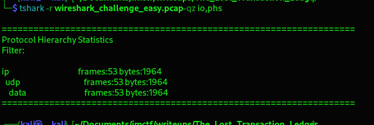
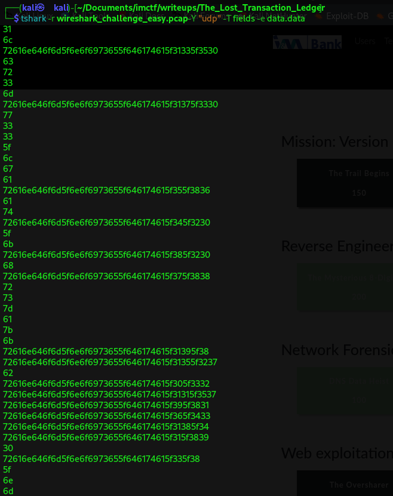
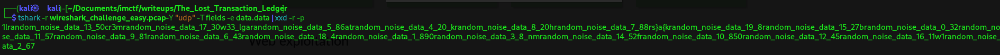
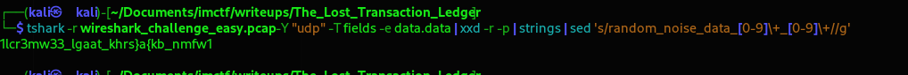
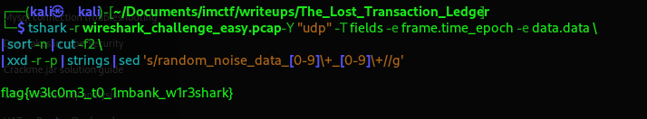

# The Lost Transaction Ledger

## Description

During a routine audit of IMBank's wire transfer system, we intercepted suspicious UDP traffic. The packets appear to contain corrupted transaction logs mixed with random noise. Our analysts suspect hidden data exfiltration—can you reconstruct the original message?

Note: Sometimes, the order of events reveals more than the content itself.

## Solution

For this challenge, I used tshark, the command-line version of Wireshark. Tshark is particularly useful in CTFs because it allows fast, scriptable analysis of large packet captures without needing a graphical interface. This makes it easier to automate tasks like extracting payloads, filtering by protocol, or piping results into other tools.

You could also use Wireshark for a more visual, point-and-click analysis, but I preferred tshark here for efficiency and flexibility.

I started by examining the protocol hierarchy to understand the distribution of traffic and identify which protocols were worth focusing on. This step helped narrow down the scope before digging deeper into the packets.
   
```bash
tshark -r wireshark_challenge_easy.pcap -qz io,phs
```



This told me everything is UDP data packets - no fancy protocols to worry about. Just raw data payloads waiting to be examined.

🧩 **First Attempt: Extracting Raw Data**

I started by dumping all the UDP payload data:
   
```bash
tshark -r wireshark_challenge_easy.pcap -Y "udp" -T fields -e data.data
```



The output was a series of hex strings - not very readable. So I converted them to ASCII:

```bash
tshark -r wireshark_challenge_easy.pcap -Y "udp" -T fields -e data.data | xxd -r -p
```



A mess! The flag was clearly fragmented and mixed with all this random_noise_data_XX_XX garbage.

**Cleaning Up the Noise**

I tried to filter out the noise patterns:

```bash
tshark -r wireshark_challenge_easy.pcap -Y "udp" -T fields -e data.data | xxd -r -p | strings | sed 's/random_noise_data_[0-9]\+_[0-9]\+//g'
```




Remembering the phrase **the order of events with time** from the challenge's description, I realized I needed to sort the packets by time:

```bash
tshark -r wireshark_challenge_easy.pcap -Y "udp" -T fields -e frame.time_epoch -e data.data | sort -n | cut -f2 | xxd -r -p | strings | sed 's/random_noise_data_[0-9]\+_[0-9]\+//g'
```



🎉 There it was! The complete, perfectly assembled flag!

🏁 The Flag

> flag{w3lc0m3_t0_1mbank_w1r3shark}

Translation: "Welcome to IMBank Wireshark" - a perfect welcome message for a Wireshark challenge!
