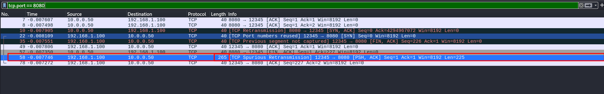
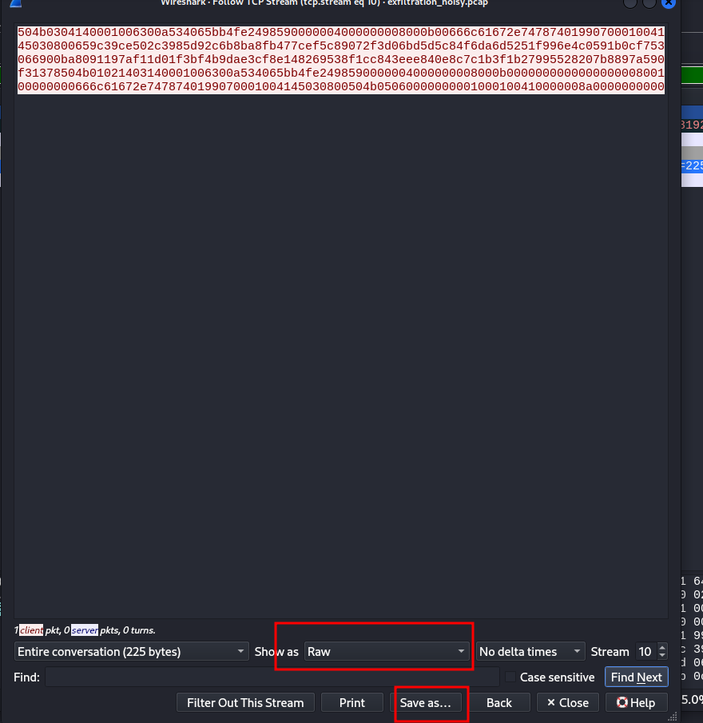
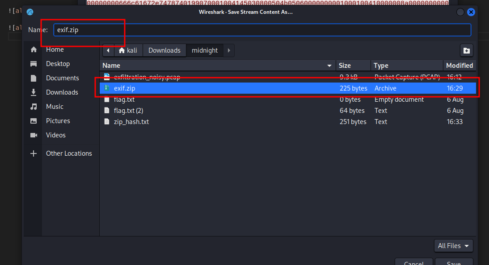
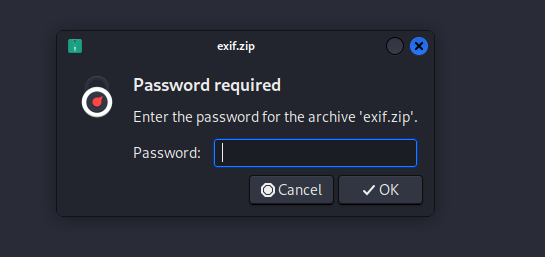
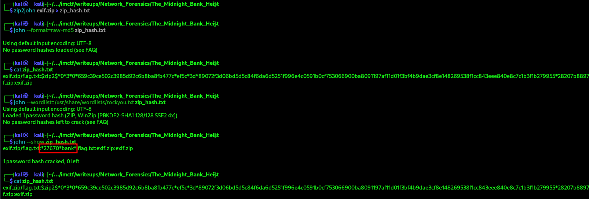
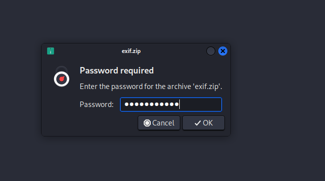

# The Midnight Bank Heist

## Step 1: Initial Analysis with Wireshark

Begin by opening the provided `exfiltration_noisy.pcap` file in Wireshark.

To quickly identify streams of interest, especially those containing large data transfers, we can sort by packet length.

In the Wireshark main window, click on the `Length column` header to sort the packets by size, descending.

Look for packets with a significantly larger length than the others. In this case, we find a packet with a length of 265.



## Step 2: Following the TCP Stream

Right-click on the identified large packet (length 265) and navigate to:

    Follow -> TCP Stream.

This will open a new window showing the entire conversation between the two hosts for that specific TCP connection.

In the `Follow TCP Stream` window, you will see a lot of raw data. 

Crucially, at the beginning of the stream, you should identify the file signature (magic bytes) for a ZIP file: PK (which in hex is 50 4B). This indicates that the transmitted data is a ZIP archive.



## Step 3: Extracting the File from the PCAP

In the `Follow TCP Stream` window, locate the dropdown menu that says `Show and save data as: ASCII`.

Change this to Raw. This ensures we save the exact bytes that were transmitted, reconstructing the original file.

Click the `Save as...` button.

Save the file as `exif.zip` (the exif hinting at "exfiltration").



## Step 4: Attempting to Extract the ZIP

Try to unzip the file. You will be prompted for a password. This means the ZIP file is password-protected.



## Step 5: Cracking the ZIP Password with John the Ripper

Since the ZIP is encrypted, we need to crack its password.

First, use `zip2john` to extract the password hash from the ZIP file into a format that John the Ripper can understand.

```bash
zip2john exif.zip > zip_hash.txt
```

View the hash file to confirm it was created. You will see a long string starting with $zip2$.

```bash
cat zip_hash.txt

#exif.zip/flag.txt:$zip2$*0*3*0*659c39ce502c3985...etc...
```

Now, use `john` with the powerful `rockyou.txt` wordlist to crack the hash.

```bash
john --wordlist=/usr/share/wordlists/rockyou.txt zip_hash.txt
```

John will quickly find the password. The output will look similar to this:

```bash
Using default input encoding: UTF-8
Loaded 1 password hash (ZIP, WinZip [PBKDF2-SHA1 128/128 SSE2 4x])
Press 'q' or Ctrl-C to abort, almost any other key for status
**\*27670*bank***    (exif.zip/flag.txt)
```

Once the password is cracked, you can view it using the `--show` flag/switch.

```bahs
john --show zip_hash.txt
```



## Step 6 : Unzip file

Now, unzip the `exif.zip` file again, providing the password when prompted.



Finally, read the `flag.txt` file to get the flag!


Here is the flag:

> CTF{Imbank_You_Found_The_Exfiltrated_Flag_And_Cracked_The_Hash!}
