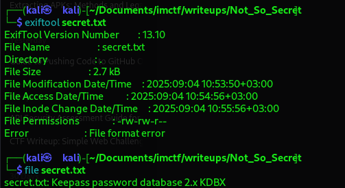
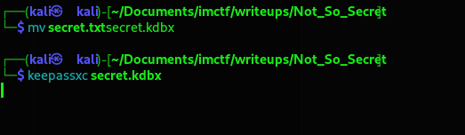
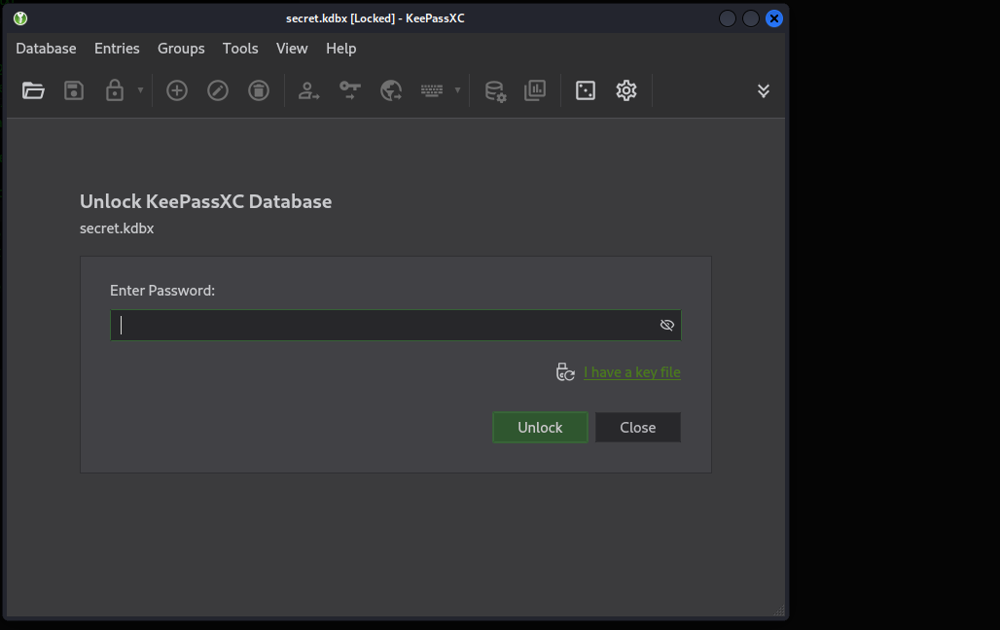
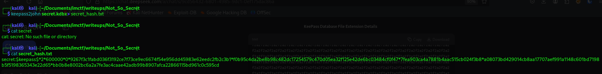
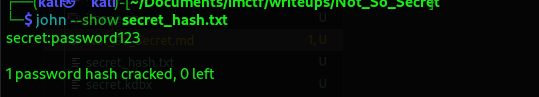
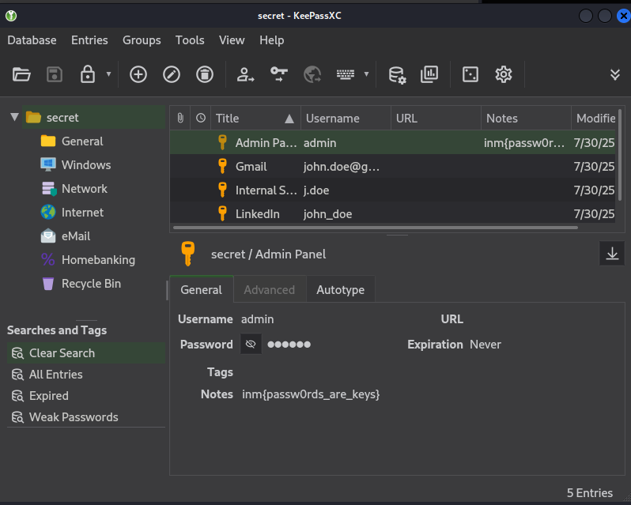

# Not So Secret

## 1. Initial Analysis

The file is named secret.txt. The first step in any CTF is to gather information about the file.

Exiftool is used to examine metadata, which can sometimes reveal the true file type or contain hidden clues

    exiftool secret.txt

Here, we see a "File format error," which immediately suggests that the .txt extension is incorrect and the file is likely something else.

To accurately determine the file's format, I used the file command, which analyzes the file's header bytes rather than relying on its extension.

 

The file command is essential for identifying a file's true type. The output reveals it is actually a KeePass password database (version 2.x).

KeePass is a popular application for storing encrypted passwords. The .txt extension was a misdirection.

## 2. Rename and open the File

To make the file recognizable, I renamed it to have the correct .kdbx extension.

    mv secret.txt secret.kdbx

Many security tools expect files to have standard extensions. Renaming it ensures compatibility and avoids confusion in subsequent steps.

I attempted to open the file with the KeePassXC GUI application.

    keepassxc secret.kdbx

This was a quick check to confirm the database was indeed password-protected. A password prompt appeared, verifying that I needed to find a password to proceed.

This confirmed that the challenge required cracking the database's master password.

## 3. Extract the Password Hash

KeePass databases are encrypted. To crack the password, I first needed to extract the cryptographic hash from the .kdbx file into a format that a cracker like John the Ripper can understand. I used the keepass2john utility for this.

    keepass2john secret.kdbx > secret_hash.txt

John the Ripper cannot work directly with .kdbx files. keepass2john parses the file and outputs a hash string (starting with $keepass$) that contains all the necessary information (encryption algorithm, iterations, salt, etc.) for John to attempt a crack.

## 4. Crack the Password with John the Ripper

With the hash extracted, I used John the Ripper to crack it

Given the challenge name "Not so secret," I suspected a weak password.

I used the famous rockyou.txt wordlist combined with John's powerful mangling rules, which intelligently create variations of words in the list (e.g., adding numbers, changing case, leetspeak).

    john --wordlist=/usr/share/wordlists/rockyou.txt --rules secret_hash.txt

## 5. Retrieve the Cracked Password

After John has finished, the --show command is used to display any successfully cracked passwords from the hash file.

John often runs silently. The --show command is the standard way to retrieve the results of a cracking session.

    john --show secret_hash.txt

It revealed the master password for the KeePass database: password123.

## 6. Access the Database and Find the Flag

Finally, I opened the KeePass database using the cracked password.
    keepassxc secret.kdbx

I entered password123 at the prompt, which successfully decrypted and opened the database. Inside, I found an entry containing the flag stored as a password for an "admin" user.

### Our Flag

    inm{passw0rds_are_keys}

## Conclusion

The "Not So Secret" challenge was a straightforward but excellent exercise in basic forensics and password cracking. The key steps involved:

    Correctly identifying a mislabeled file type.

    Understanding the need to extract a hash for offline cracking.

    Effectively using John the Ripper with wordlist rules to crack a weak password.
