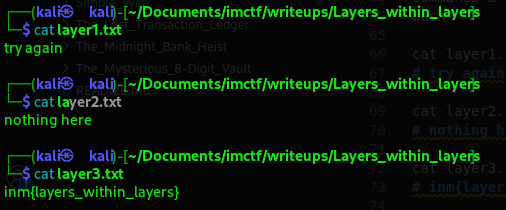

# Layers within layers

## 1. Initial Reconnaissance with `binwalk` 

The first step with any file is to understand its structure. I used `binwalk` to analyze the IM_Bank.jpg file for any embedded files or data structures.

    binwalk IM_Bank.jpg

> Binwalk did not find any obvious files appended to the end of the JPEG. This indicated that if data was hidden, it was likely concealed using a method other than simple file appending.

## 2. Metadata Analysis with exiftool

Often, crucial clues are hidden in plain sight within a file's metadata. I used exiftool to inspect the JPEG's metadata for comments or unusual tags.

This was the _**critical first clue**_. The Comment field contained a clear hint: **`PasswordtoZip=Y29tcGxleHBhc3M=`**. 

The value Y29tcGxleHBhc3M= is a Base64 encoded string. This strongly suggested that a ZIP archive was involved somewhere, and this was the password for it.

## 3. Discovering Hidden Data with `steghide` 

Since `binwalk` didn't find anything, the next logical step was to check for steganography. I used `steghide` to see if data was embedded within the image itself.

The info command revealed that the JPEG contained an embedded, encrypted ZIP archive named IM_layer.zip.

## 4. Extracting the Hidden Archive

I proceeded to extract the hidden ZIP file from the image using `steghide`.

Crucially, `steghide`  did not require a passphrase for extraction in this case.

The IM_layer.zip file was successfully extracted to the current directory.

## 5. Cracking the ZIP Password

I attempted to unzip the archive, which prompted me for a password.

The extraction failed because I didn't have the password yet. I remembered the Base64 string found in the metadata (Y29tcGxleHBhc3M=). 

I decoded it to find the password.

## 6. Extracting the Files

I ran the unzip command again, this time providing the decoded password.

The password was successful! Three text files were extracted: layer1.txt, layer2.txt, and layer3.txt.

## 7. Unveiling the Flag

I examined the contents of each extracted text file to find the flag.

The final file, layer3.txt, contained the string

    inm{layers_within_layers}

This flag perfectly summarizes the challenge, which involved navigating through multiple layers (JPEG metadata -> Steganography -> ZIP archive -> Multiple text files).
