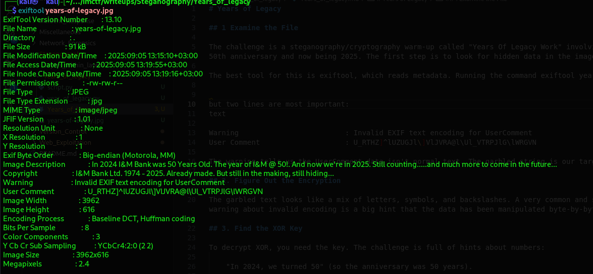

# Years of Legacy

## 1 Examine the File

The challenge is a steganography/cryptography warm-up called "Years Of Legacy Work" involving a JPEG image. The description talks about the year 2024 being a 50th anniversary and now being 2025. The first step is to look for hidden data in the image file.

The best tool for this is exiftool, which reads metadata. Running the command *exiftool years-of-legacy.jpg* gives a lot of output,

Two lines are most important:

    Warning                         : Invalid EXIF text encoding for UserComment
    User Comment                    : U_RTHZ]^lUZUGJl\]VlJVRA@l\Ul_VTRPJlG\lWRGVN

The warning tells us the UserComment data isn't normal text. The garbled string is our target. This is what we need to decrypt.

## 2. Figure Out the Encryption

The garbled text looks like a mix of letters, symbols, and backslashes.

A very common and simple way to hide data like this in CTFs is with an XOR cipher.

The warning about invalid encoding is a big hint that the data has been manipulated byte-by-byte, which is what XOR does.

## 3. Find the XOR Key

To decrypt XOR, you need the key. The challenge is full of hints about numbers:

    "In 2024, we turned 50" (so the anniversary was 50 years).

    "It's 2025 now."

    The copyright says "1974 - 2025".

The first key you might try is 50. When that doesn't work, you think about the next logical step: if they were 50 in 2024, how old are they in 2025? The copyright date gives us the exact math: 2025 - 1974 = 51.

The key is 51.

## 4. Write the Decryption Script

XOR decryption is simple: you take each character of the ciphertext, XOR it with the key, and convert the result back to a character.

This Python script does exactly that:
    '''bash

    def xor_decrypt(ciphertext, key):
        decrypted = []
        for char in ciphertext:
            decrypted_char = chr(ord(char) ^ key)
            decrypted.append(decrypted_char)
        return ''.join(decrypted)

    def main():
        print("XOR Decryption Tool")
        print("-------------------")
    
        # Ask for ciphertext input
        ciphertext = input("Enter the ciphertext to decrypt: ").strip()
    
        # Ask for XOR key (decimal)
        while True:
            try:
                key = int(input("Enter the XOR key (decimal number, e.g., 51): "))
                break
            except ValueError:
                print("Invalid key! Please enter a number (e.g., 51).")
    
        # Decrypt and print
        plaintext = xor_decrypt(ciphertext, key)
        print("\nDecrypted Message:")
        print("-------------------")
        print(plaintext)

    if __name__ == "__main__":
    main()

## 5. Run the Script and Get the Flag

When you run the script with the ciphertext and the key 51, it prints out the decrypted message which is the flag.

## FLAG

    flag{inm_fifty_one_years_of_legacy_to_date}
