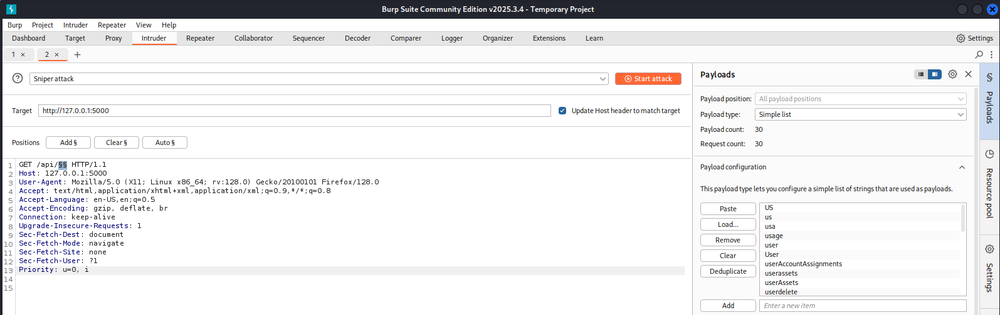
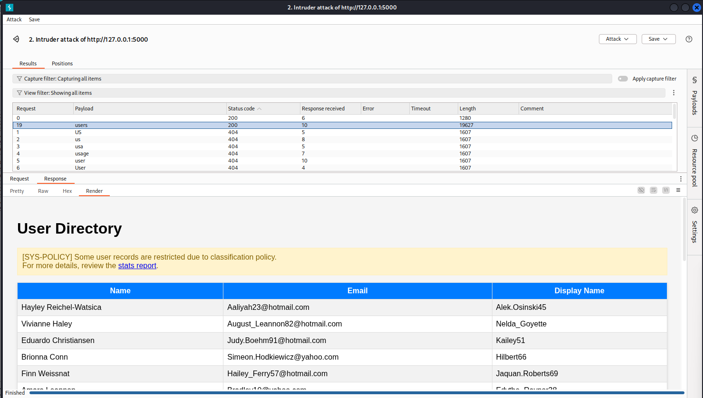
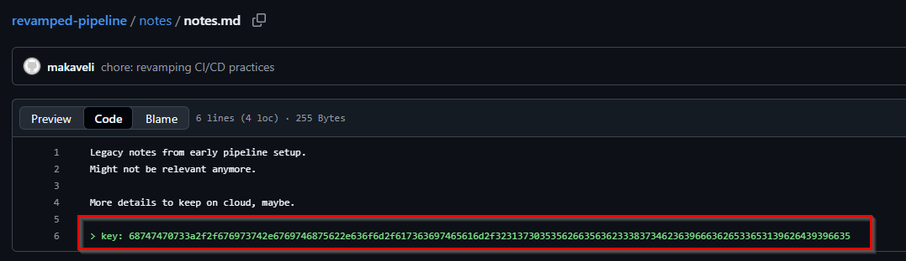
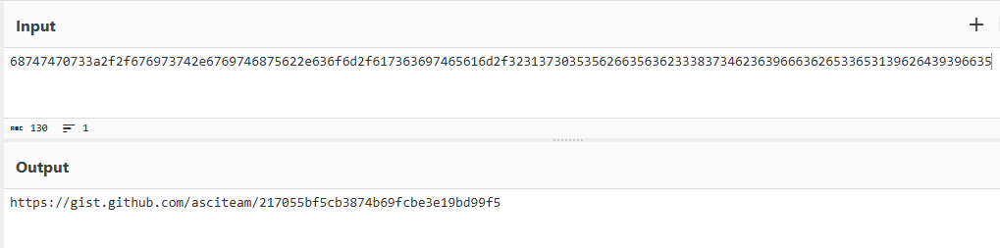
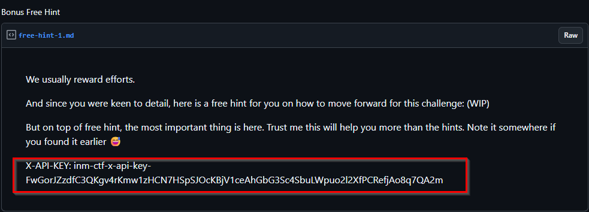
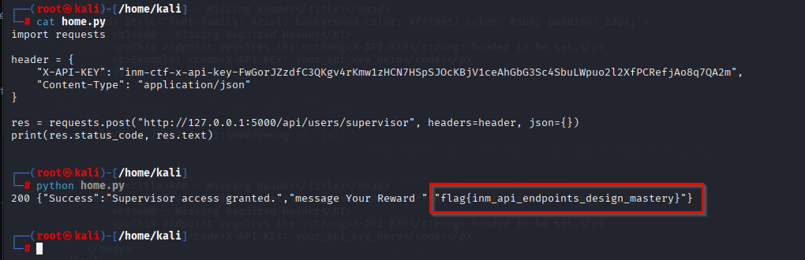

# Dock and Leak Challenge
# InvisiTech — Asset API CTF: Step‑by‑step writeup

**Description**

> Another piece of InvisiTech Lab's internal tooling has surfaced.
>
> It looks like an asset management API, but the Docs never made it out of staging!
>
> Strangely enough, the system isn’t entirely silent - it drops hints in its errors, and some of the developer’s “oops” moments on GitHub might be more revealing than they thought.
>
> Your job? Piece together the endpoints, follow the breadcrumbs, read what the system whispers, and bring the right HTTP headers to prove you can get inside.
>
> **NOTE:** This challenge requires you to have a local installation of docker on your machine. An image is provided that you need to run locally on your device. The container runs on TCP port 5000 and can be accessed at `localhost:5000` after you have followed the steps below on "**How to run the docker container**"

---
**How to run the docker container**

This challenge runs as a Docker image. You need Docker installed locally on your machine to play :)
	
Step 1: Pull the image

   ```
   docker pull n7es1/invisitech-inhouse:latest
   ```

Step 2: Run the container (maps service to localhost:5000):

   ```
   docker run -it -p 5000:5000 n7es1/invisitech-inhouse:latest
   ```

Step 3: Once running the API will be accessible at `http://localhost:5000`
	
_That’s all you need to start exploring._

---

## Goal

Capture the flag by discovering hidden API endpoints, following error hints, and presenting the correct HTTP header (`X-API-KEY`) to the `/supervisor` endpoint.

---

## Prerequisites

* Docker installed and running locally.
* A terminal on Linux/macOS/WSL; or PowerShell on Windows.
* Optional: Burp Suite (proxy + Intruder) or ffuf/ ffuf-like fuzzer and SecLists wordlists.

---

## How to run the Docker container

**(As provided in the challenge)**

   ```bash
   # Step 1: Pull the image
   docker pull n7es1/invisitech-inhouse:latest
   
   # Step 2: Run the container (maps service to localhost:5000)
   docker run -it -p 5000:5000 n7es1/invisitech-inhouse:latest
   
   # Step 3: Access the API
   # Open http://localhost:5000 or use curl
   curl -i http://127.0.0.1:5000/
   ```

The app will answer on port `5000` on your docker host. e.g., your local host in this case unless you run it from a VPS 😅

---

## Reconnaissance (manual checks)

1. Start with simple probes and look carefully at the error messages/responses the API returns — they *whisper* hints.

   ```bash
   # Quick check root and common endpoints
   curl -i http://127.0.0.1:5000/
   curl -i http://127.0.0.1:5000/debug
   curl -i http://127.0.0.1:5000/api/inventory
   curl -i http://127.0.0.1:5000/api/analytics
   ```

You will see helpful error messages such as `405 Method Not Allowed` and text like `This endpoint only accepts POST requests.` — these tell you the expected method and where to focus on fuzzing.

---

> **Rule of thumb:** read every error — error responses often leak file paths, expected methods (POST vs GET), or auth details. This challenge was built around that: pay attention to what the API exposes and use those clues to craft the requests that reveal the flag.

---

## Fuzzing the `/api/` namespace

The API hinted that sibling paths to `/api/inventory` and `/api/analytics` exist. Use a wordlist to fuzz `/api/FUZZ` and discover hidden categories. See below:

> Note that the above two endpoints can be discovered by checking the responses returned when you access a non-existent path under `api/{any-path}`. See below when accessing `api/in` for instance.


> Whether in a browser or an API tool, the above response is observed, which opens the door to examine the `/api/inventory` and `/api/analytics` endpoints. Note that the verbose 404 error message is returned for any path the API treats as a 404 — this expands the various possible ways a player might end up at the inventory and analytics endpoints while fuzzing.
>
> For instance, going to `/api/inventory` shows that other endpoints exist below it, namely `stats` and `details` (i.e., `/api/inventory/stats` and `/api/inventory/details`).
>
> The `/debug` endpoint is accessible from the API root. GET is not allowed, as you may have observed in a browser; however, a POST request is accepted. However, this endpoint remains to be a decoy for this challenge.

Now we know that every major submodule of the API has `details` and `stats` sub-endpoints. But let's go back to our 404 error message. One line stands out:  
`"[SYS-DEBUG] Additional subsystem/module online: directory service"` — what is the directory? Does it exist? Trying to access it returns 404. What does "directory" mean — user directory? Maybe try `/api/user` or `/api/users` — boom, there we are. We have identified another submodule from the error messages.

We should know by now to try `details` and `stats` under `/users` — and indeed they exist. Of the two, `/api/users/stats` leaks more useful information, so we are on the right path. This is the assumption if we are manually interacting with the API and building our own breadcrumbs, as opposed to immediately fuzzing the entire API (which would also eventually land you in a similar place. Only difference being the later gives you limited starting point to progress after indentifying the endpoin, though every other player will have their opinion of this - though I digress 😂).

The `stats` endpoint leaks an admin path. Accessing it does not accept an HTTP GET; we have to use POST. Sending a POST to `/api/users/admin` further leaks important info — the response asks for a strange header named `X-LEGACY-KEY`, and the error message helpfully directs us where to look for the correct value of this header.


> The error points us to the Invisitech-Labs GitHub organization: the key was used in CI/CD onboarding/deployment workflows. Luckily, there is a repo called `onboarding-pipeline` that gives us a direct correlation.
>
> Opening the `onboarding-pipeline` repo reveals a GitHub workflow file with the legacy key just sitting there waiting for us to pick it up:


> Using that value as the `X-LEGACY-KEY` header and sending a POST to `/api/users/admin` works — we get a new response

> (**the challenge designer wanted us to do a bit of dev recon; I thought we had the flag at that point! Dang!**).

Now the response gives us a different prompt:


> This time the API asks us to access restricted records at `/api/users/supervisor`. Definitely this looks like the flag. Let's gooo!

But sending a POST to `/api/users/supervisor` returns `401 Unauthorized`. The response tells us exactly what it needs: the `X-API-KEY` header. (Remember this challenge was tagged `http-headers`.) A good hacker might try sending `X-API-KEY` with no value or with guessed/gibberish values to see how the API responds — and here that skill pays off. The API rejects our guessed `X-API-KEY` but returns a message telling us where to find the real key.


It clearly instructs us to check the pipeline notes — which sends us back to the Invisitech-Labs GitHub org. In the pipeline notes (in this repo — you had to do another recon to identify which repo to check: [revamped-pipeline](https://github.com/InvisiTech-Labs/revamped-pipeline/blob/36be6e40a4de3e62fbc28ea82701c37b88ec5cd2/notes/notes.md) it was straightforward to map things: the new developer "makaveli" introduced a wave of improvements, so `revamped-pipeline` is the likely place to look rather than the older `onboarding-pipelin` repo.

The notes inside the `revamped-pipeline` repo do not contain the key directly. Maybe copy the hex present there and pass it as our `X-API-KEY`? Let's send that hex value `[hex her]`.

On the first submission the API seems not to accept it — it looks like it didn't even receive it. Resending once still yields nothing. On the third attempt we get a different error message. Woah — the challenge designer really led us on.


Now the HTTP status code is one of a kind: `418`. What is `418` (I'm a teapot)? If this is your first time, read about it here: [HTTP Status Code 418](https://developer.mozilla.org/en-US/docs/Web/HTTP/Reference/Status/418).

The error gives more details: it tells us to check the formatting of the value we passed. The hex — yes. But what is that hex? Let's pull up CyberChef to inspect the value:


> CyberChef returns (even using the Magic operation) a gist link: {gist link her}}.
>
> The gist is tantalizing — it contains the `X-API-KEY` we have been searching for. Take the key and feed it to the POST request for `/api/users/supervisor`.


> Using the value from the gist: `{value here}` successfully returns the long-sought flag:


**NOTE:** The above steps are the expected flow of access through the API to get the flag. Although many paths can be reached through fuzzing, fuzzing may hit endpoints but miss the breadcrumbs that help you construct the sequence of requests expected by the API until you reach the final endpoint. An alternative approach is to rely more heavily on fuzzing; that can also work and is briefly discussed below.


### Option A — `ffuf` (fast and suited for path fuzzing)

```bash
# example (replace wordlist path with your local SecLists or custom file)
ffuf -u http://127.0.0.1:5000/api/FUZZ -w ~/wordlists/api_endpoints.txt -mc 200,201,202,301,302,401,403 -fs 0
```

* `-mc` filters by status codes you find interesting.
* `-fs 0` filters out empty responses.
* More details on `ffuf` and its usage can be referenced on their official Github page: [https://github.com/ffuf/ffuf](https://github.com/ffuf/ffuf)

### Option B — Burp Suite Intruder (GUI)

1. Proxy a normal request to `/api/inventory` through Burp.
2. Right‑click → Send to Intruder.
3. In **Positions**, replace the `inventory` token with a single fuzz position `§inventory§`.
4. In **Payloads**, load your API wordlist (SecLists or your curated list).
5. Configure **Grep – Match** rules to catch non‑404 responses or specific JSON markers.
6. Launch attack and review results (look at status, response length, and response body).

   

   

---

## Narrowing down with targeted checks

- Once a candidate endpoint is found (e.g. `/api/users`), test common subpaths by hand and watch for different responses or hints
- Note that the /api/{any-non-existent-path} results to a verbose 404

- Try GET/POST and check allowed methods
  
   ```bash
   curl -i http://127.0.0.1:5000/api/users
   curl -i -X POST http://127.0.0.1:5000/api/users -d '{}'
   ```

- Example: `/api/users/supervisor` returned an error and a hint to submit `X-Api-Key`

  ```bash
  curl -i http://127.0.0.1:5000/api/users/supervisor
  ```

- Response:
  > -> "Method Not Allowed for Supervisor clearance request." and hint "Submit with correct X-Api-Key."

This tells you two things:

* The endpoint likely requires `POST`.
* The API expects an auth key in the `X-Api-Key` header.

> But the question at this point is, what value do I pass to the `X-Api-Key` header? A real hunter would attempt to only give the header with no value at all, gibberish value, and even bruteforce arbitrary values. Have you tried or thought of that?

---

## Hunting for the key (breadcrumbs)

Developers sometimes leave pointers in code or configuration. 

In this challenge we found a hex blob that decodes to a URL (a GitHub Gist) pointing to more hints.

* <https://github.com/InvisiTech-Labs/revamped-pipeline/notes/notes.md>

* 

### Decode the key from HEX

* 

The decoded string produced a URL like `https://gist.github.com/asciteam/217055bf5cb3874b69fcbe3e19bd99f5` — inspect the gist for an X-API-KEY

* 

## Using the discovered API key

Once you have the key (format: `inm-ctf-x-api-key-FwGorJZzdfC3QKgv4rKmw1zHCN7HSpSJOcKBjV1ceAhGbG3Sc4SbuLWpuo2l2XfPCRefjAo8q7QA2m`) call the supervisor endpoint with a `POST` and include the header.

A successful response returns `200` and a JSON body containing the flag.

### Python `requests` example

* 

---

---

## Conclusion

Following the hints in the API errors, fuzzing the `/api/` namespace, decoding the developer-left hex link, and supplying the discovered `X-API-KEY` allowed us to gain supervisor access and capture the flag:

**Flag:** `flag{inm_api_endpoints_design_mastery}`

---


