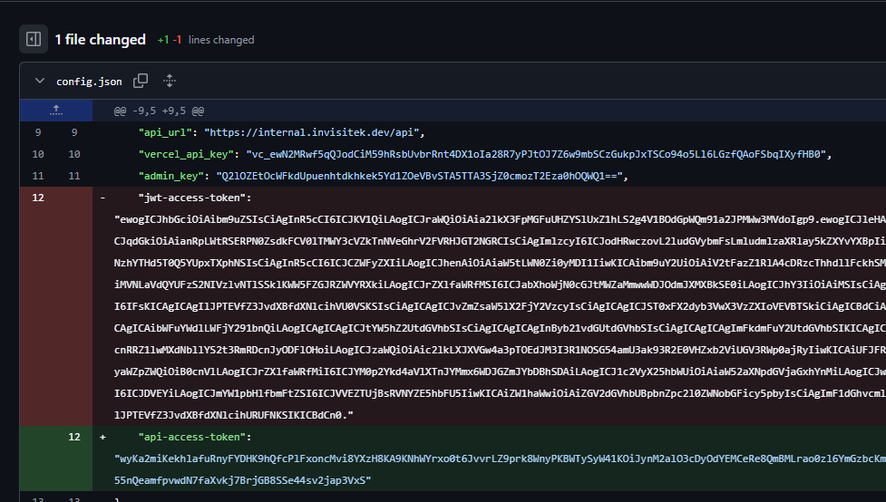

# CTF Challenge: "Makaveli the committer"
## Challenge Hint
> *"They say the internet never forgets...  
> And honestly, the Wayback Machine kinda proves that.  
> But does GitHub work the same way? 🤔 Maybe. Maybe not. Only one way to find out."*

This clearly pointed toward **GitHub commit history** — even if files are deleted, older commits may still hold secrets.

---

> **The direct solution steps are given below. After the steps, you’ll find additional details describing the hints that would have led you to this commit.**

## Steps to Solve

### 1. Identify the Repository
From the hint and challenge description, the target repository was:InvisiTech-Labs/cli-planner

### 2. Browse Commit History
- Navigate to the repo on GitHub.  
- Open the **Commits** tab.  
- Scroll through older commits, focusing on ones that referenced  **authentication**, **tokens**, **secrets**, or **JWTs**.  

Eventually, an older commit revealed a file containing a **JWT access token**.  
The file had since been deleted in later commits, but GitHub preserved it in history.

### 3. Extract the JWT
The recovered token looked like this (truncated):

  - "exp": 1760520000,
  - "iat": 1752832295,
  - "azp": "inm-ctf-2025",
  - "email": "devteam@invisitechlabs.io",
  - "key_id_1": "ZmxhZ3tpbm1fZ2l0X2NvbW1pdHM",
  - "key_id_2": "X3JvbGxiYWNrX2lzX2FfbXl0aH0",
  - "preferred_username": "aW52aXNpdGVjaGxhYnM=",
  - "family_name": "Q1RGMjAyNQ=="

### 4. Decode Embedded Base64 Values

- Some fields in the payload were base64 strings themselves (see the _Extra Notes_ section below for more details):

- key_id_1 → flag{inm_git_commits

- key_id_2 → _rollback_is_a_myth}

### 5. Concatenating them gave the final flag

> flag{inm_git_commits_rollback_is_a_myth}

## Extra Notes

- The challenge description mentions a **TODO** item.
- The GitHub account contains many repos aimed at development work.
- One repo appears related to task planning; the challenge description hinted at planning. **This is the repo to focus on.**
- The challenge name itself contains the word **committer**. The `cli-planner` repo is one of the most-committed repos — another hint to check it.
- In that repo, three files are of interest: `tasks.py`, `app.py`, and `config.json`.
- The two Python files contain little useful information; `config.json` contains the juicy bits. We need to inspect its commit history — the file has **five commits** in total.
- Dig through the commit history and inspect the file changes across those commits.
- Two commits related to auth fixes/updates stand out. In the `update auth flow` commit, an `admin-key` and a `jwt-access-token` are introduced.
- A later `fix auth access` commit removes the `jwt-access-token`.
  
> That pattern is suspicious — **why add a token only to remove it immediately? Developer mistakes happen: secrets can be accidentally committed and, even if removed, remain in the repo history**.

- The final commit to this file replaces the `jwt-access-token` with a new value.
- The removed `jwt-access-token` is our target. Compare the two tokens and examine their payloads. The token currently in `config.json` has two interesting payload fields: `key_id_1` and `key_id_2`. Both appear to be encoded.
> Note: decoding the JWT token can be done using [jwt.io](https://www.jwt.io/).

- The JWT payload includes several decoy fields — you can inspect them, but they won’t contain the flag. Classic CTF misdirection, right? 🙂

- After decoding (_you can use cyberchef to easily determin the encoding used for the two value_), the values for `key_id_1` and `key_id_2` in the current token show a pattern that confirms we are on the right path — the valuable data is likely in the earlier, removed token.

_These are the 2 key Ids from the payload_
  
  

  

_Decoding the values using cyberchef's 'magic' operation gives us the folloiwing hint necessary for our next steps:_

  

  

- Decoding the old (removed) token reveals the same payload structure; this time `key_id_1` and `key_id_2` contain the flag.
- This maps directly back to **Step 4** in the solution steps above.
