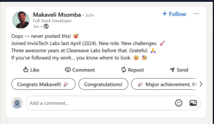
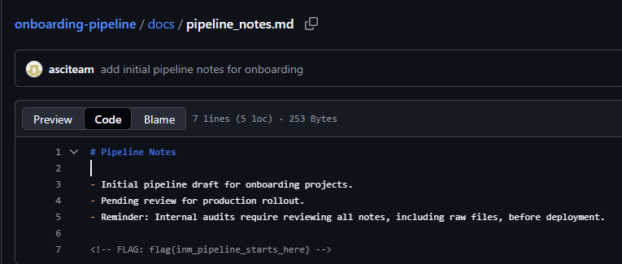

# CTF Write-up — The trail begins

## Challenge Overview
You are provided with an image file. The image serves as a hint leading you to the next stage.

-

## Steps to Solve
1. **Download the image** from the CTF portal.
2. **Inspect the image** — the embedded information points to a LinkedIn profile of the user.
3. **Visit the LinkedIn page** — within the profile, you’ll find a reference to the user’s GitHub account.
4. **Navigate to the GitHub repository**:

## https://github.com/InvisiTech-Labs/onboarding-pipeline.git

5. **Explore the repository** — inside the `docs` folder, open:

## onboarding-pipeline/docs/pipeline_notes.md

- The flag is located in `pipeline_notes.md`.

- 

- FLAG: flag{inm_pipeline_starts_here}
