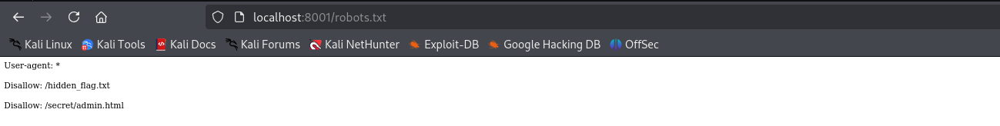
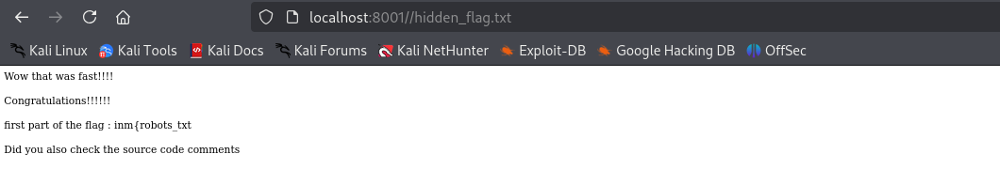
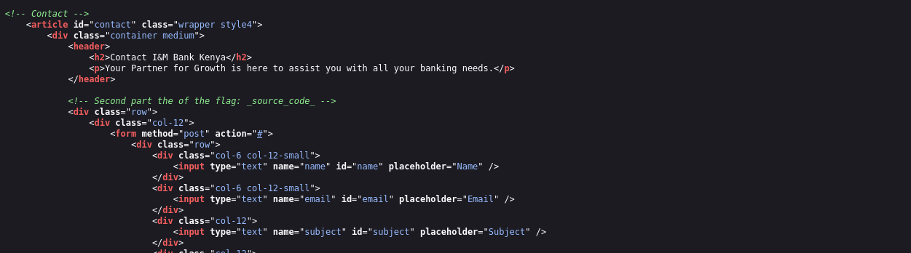
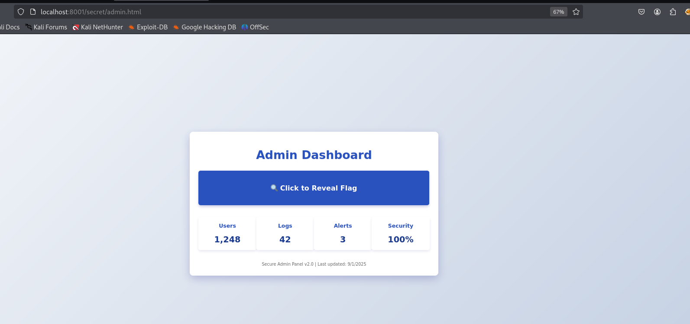
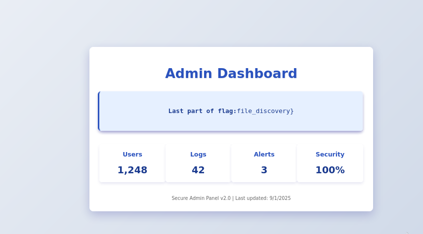

# Simple Web
The challenge description immediately emphasized exploration, observation, and discovery. It specifically hinted that secrets were "tucked away, politely asking bots to ignore them." This was a massive clue pointing directly to the robots.txt file. Websites use this file to instruct web crawlers (like those from Google or Bing) which parts of the site they are not allowed to scan. This is often used to hide sensitive directories and files from search engine results.

My first step was to navigate to the robots.txt file by appending /robots.txt to the challenge URL.

## Discovering the Forbidden Paths

Upon visiting http://<challenge-url>/robots.txt, I was presented with the following content:
text

This file tells all web crawlers (User-agent: *) that they are not allowed to access two resources: /hidden_flag.txt and /secret/admin.html. 

For a CTF player, this isn't a "do not enter" sign; it's a treasure map. I knew these were the first places I needed to visit.

## Retrieving the First Flag Fragment

Following the first directive, I navigated to /hidden_flag.txt. The page contained a congratulatory message and the first piece of the flag:

It also provided another crucial hint: "Did you also check the source code comments." This told me that simply viewing the page wasn't enough; I needed to dig deeper into the HTML that builds the page.

## Uncovering the Second Flag Fragment

To view a webpage's source code, you can either:

    Right-click on the page and select "View Page Source" (or a similar option like "Inspect" to open the developer tools).

    Use the keyboard shortcut Ctrl+U (on most browsers).

I went back to the main challenge homepage and viewed its page source. I carefully scanned through the HTML code, paying special attention to comments, which are denoted by <!-- comment here -->. After a short search, I found a comment within a contact form section that contained the second part of the flag:
html

## Finding the Final Flag Fragment

With two parts of the flag in hand, I returned to the robots.txt map. There was still one disallowed path I hadn't checked: /secret/admin.html.

I navigated to this URL. The page itself appeared to be a simple, static admin panel placeholder. Remembering the lesson from the previous step, I didn't just look at the rendered page. I immediately viewed the source code of this admin page. There, nestled in the HTML, was the final clue I needed:
html

Flag Assembly:

Putting them together, the complete flag was:
    *inm{robots_txt_source_code_file_discovery}*
