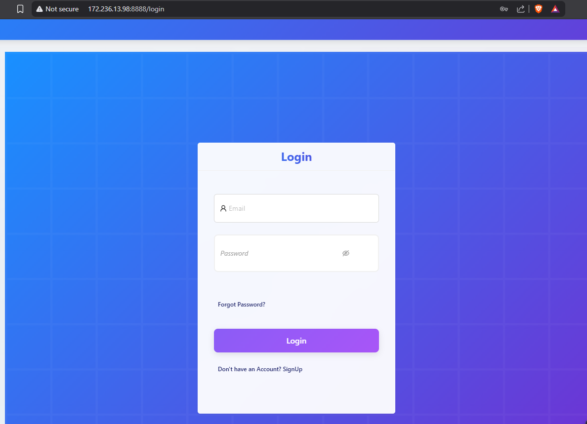
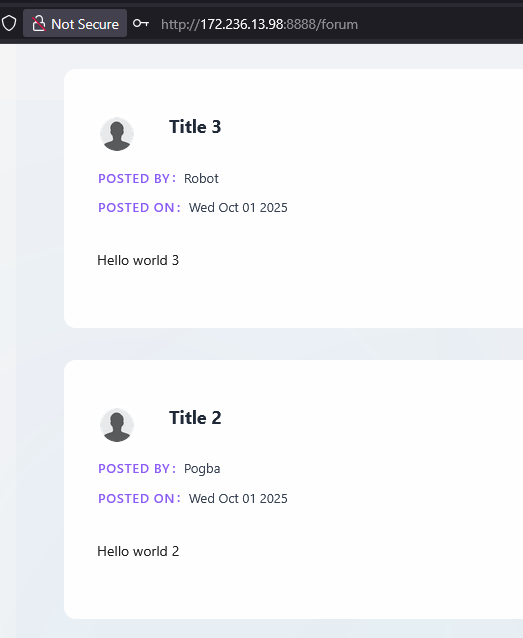
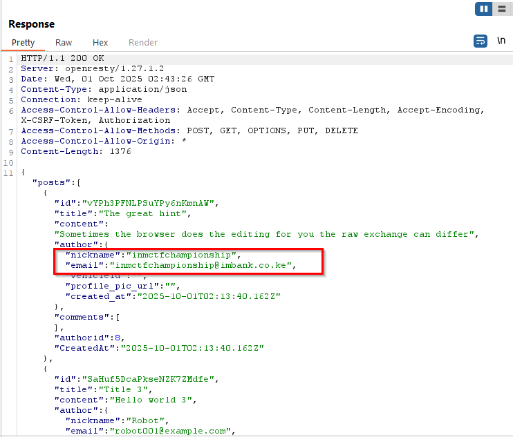

# The Oversharer Challenge

## Challenge Description
    The challenge involves discovering an API endpoint that leaks sensitive information in the background. 
    The target is a web application running at http://172.236.13.98:8888 that contains various API endpoints, one of which overshares user identity information.

## Solution

### Step 1: Initial Reconnaissance
    First,  navigate to the main application URL:

    http://172.236.13.98:8888
    The application appeared to be a web service with multiple API endpoints.
    Create an account and log in.
    Browsed through the visible interface to understand the application structure and identify potential endpoints.
    

### Step 2: Exploring the Forum Endpoint
    As hinted in the challenge description, navigate to the forum endpoint:

    http://172.236.13.98:8888/forum
    This displayed a forum interface where users could presumably post messages and interact with the application.
    

### Step 3: Traffic Analysis with Proxy
    To intercept and analyze the background API calls, I used a web proxy (Burp Suite) to monitor the network traffic while interacting with the forum page.

    Process:

    Configured browser to use Burp Suite as proxy

    Enabled interception in Burp Suite

    Refreshed the forum page and interacted with its features

    Monitored all HTTP requests and responses

### Step 4: Discovering the Oversharing API
    While monitoring the traffic, notice several API calls being made in the background. One particular endpoint was leaking sensitive user information, including email addresses.

    The vulnerable API endpoint was:

    http://172.236.13.98:8888/community/api/v2/community/posts/

   
    

### Step 5: Extract the Flag
    inmctfchampionship@imbank.co.ke

